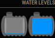

# IconDisplayer

Module for [MagicMirror](https://github.com/MichMich/MagicMirror/) showing the payload of a Notification from MAgicMirror (Modules).

## Screenshots




## Installation

Go to `MagicMirror/modules` and write

    git clone https://github.com/wiedsee/MMM-IconDisplayer.git
    cd MMM-IconDisplayer
    npm install

## Configuration

This module shows an icon if there was a notification with the title of "topic:" end its between the "max"and "min" values.
The module is developed with MMM-MQTT notifications in mind. (check below for the configuration of MMM-MQTT)

You can add your own icons to MagicMirror/modules/MMM-IconDisplayer/icons


Here is an example configuration with description. Put it in the `MagicMirror/config/config.js` file:

```javascript
		{	module: "MMM-IconDisplayer",
			header: 'Water levels',
			position: "top_right",
			config: {
				preferences: [
					{	topic: "Tank_1", // topic name for the MQTT message
						icon: "10", // icon name to display
						max: 10, // maximum value to display icon
						min: 10, // minimum value to display icon
					},
					{	topic: "Tank_2", // topic name for the MQTT message
						icon: "20", // icon name to display
						max: 10, // maximum value to display icon
						min: 10, // minimum value to display icon
					},
				],
			},
		},
```

## Configuration for MMM-MQTT

To be able to use this module with MMM-MQTT you will have the change one line in the MMM-MQTT.js file
You can find this line under "setSubscriptionValue" around line 84.
You will need to replace "```javascript this.sendNotification("MQTT_MESSAGE_RECEIVED", payload);```" with "```javascript this.sendNotification( payload.topic , payload.value);```"
And both Topics Need to be exactly the same for it to work properly.
